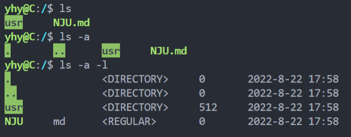
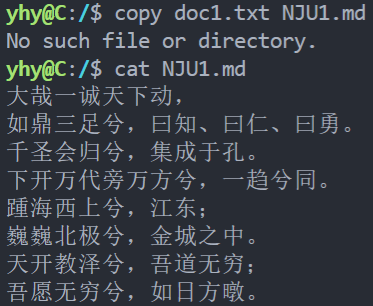
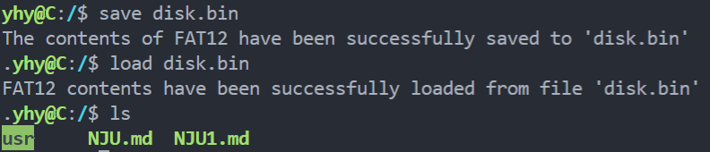
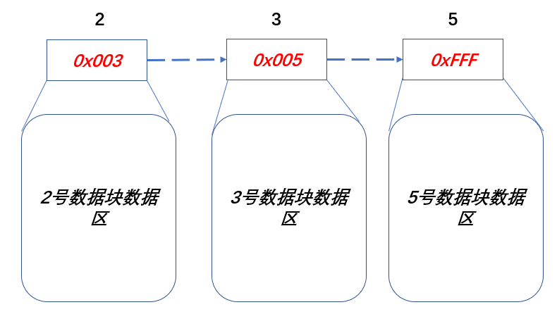
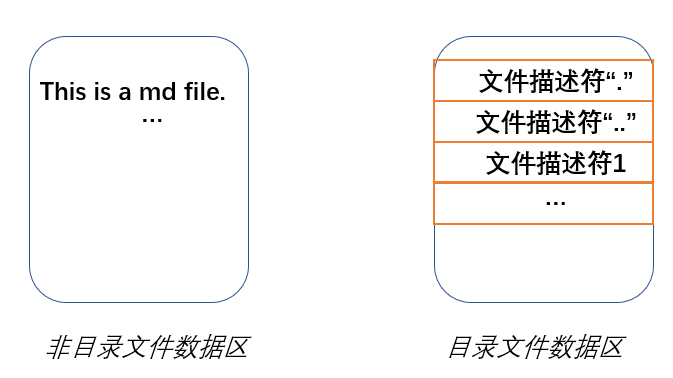

# FAT12-File-System
## 一、概述
**作者**：yhy
**时间**：2022.8.22
**项目地址**：https://github.com/HuiyuanYan/FAT12-File-System.git
**项目简介**：用C语言实现的简易FAT12文件系统，并写了简单的shell用于交互。
**项目目的**：通过简单的编码了解FAT12文件系统的构成和运行原理，并用C语言模拟文件系统的运行，同时强化C语言编码能力。
**运行及编码环境**：vscode + WSL:Ububntu-20.04
## 二、项目构成
```
.
├── picture #说明文档用到的图片
├── README.md 
└── src
    ├── .gitignore
    ├── FAT12.c #FAT12功能函数实现源文件
    ├── FAT12.h #FAT12结构及相关声明
    ├── Makefile #用于构建本项目所需的Makefile
    ├── doc1.txt #用于测试copy命令所需的文本
    ├── main.c #程序入口，包括初始化系统、创建根目录、进入shell等
    ├── shell.c #简易shell实现源文件
    └── shell.h #shell声明
```
## 三、项目运行展示
shell的实现只是为了能够与FAT12文件系统实现交互以证明其正确性，所以只进行了简易的实现。shell中所给的文件路径也必须是**本文件夹中的文件名**。

通过命令：
``` shell
make
```
生成可执行文件并运行。

这里展示自制shell的部分命令运行效果，以说明该文件系统能够正常运行。
支持的命令及用法可以通过进入shell用`help`查询或者直接参阅源码。
### 1. ls命令
ls命令只支持下面几种用法：


### 2. cat命令
cat命令只实现了输出文件内容到标准输出中。


### 3. copy命令
copy命令可以把位于本机(我这里是Windows)的文件复制到正在运行的FAT12文件系统中当前目录文件里去。

示例命令：
```shell
copy doc1.txt NJU1.md #把doc1.txt复制到NJU1.md中
cat NJU1.md
```

运行效果：


其中会提示`No such file or directory.`是因为文件系统没有在当前目录下找到`NJU1.md`，会去新创建该文件并执行复制过程。

### 4. load和save命令
为了能够保存/导出`disk`方便下次使用，魔改实现了这两个命令：
```shell
save xxx.bin #将disk以二进制文件形式保存到本机文件中
load xxx.bin #加载本机文件到目前运行的disk中
```

运行效果：


### 5.其它命令
可以进入shell后通过`help`查看支持的命令（非常有限且实现简单，但已经能够说明问题了）。

## 四、实现原理
下面主要介绍并说明FAT12文件系统实现的原理，部分代码会在文档中予以展示，完整代码请参照上面的项目地址。

### 4.1 FAT12系统原理
这部分网上已经有很多内容讲述，下面的内容主要参照搜集网上的资料和个人理解。

#### 4.1.1 FAT12文件系统
FAT（**File Allocation Table**）是计算机文件系统，DOS时代就开始使用的文件系统（File System)，FAT12（**FAT项长度为12比特**）文件系统是最古老的版本。

+ FAT的命名由来是由于它把文件表项（**Entry**）存储在数据卷开头的表中。

+ 为了使系统能够正确定位，FAT表和根目录项都必须存储在一个固定的位置。

+ FAT文件系统的数据都通过**簇** **(cluster)** 这一基本单位来组织。

#### 4.1.2 簇
什么是簇？

**FAT表**是由一个个**簇**组成（簇的数量取决于数据区的大小），每个簇是一个**固定比特长度**的数。对于**FAT12**来说，簇的长度为12位，它表示当前簇指向的下一个簇。可以把“簇”的组织形式当成一个链表：
+ 如果2号簇储存的数字为3，那么说明2号簇指向3号簇。3号簇的12位数字储存的是5的话，那么说明3号簇指向5号簇。链表的空指针NULL（结尾标志），使用0xFFF表示。

如此，分散在各个数据区块的数据便可以通过簇有效地组织起来。

FAT表的**0号簇和1号簇不能使用**，他们储存的是坏簇标记0xFF0和结尾标志0xFFF。

在FAT12系统中，由于每个簇的大小是`12bit`，而计算机操作数据又是以字节（`8bit`）为单位进行的，所以在实际编码和操作过程中，我们可以每次存取两个簇：
```c
typedef struct FAT2Entry //FAT表项，以两个簇为基本操作单位
{
    //两个簇
    int firstEntry : 12;
    int secondEntry : 12;
} __attribute__((packed)) FAT2Entry; //取消字节对齐
```
那么对于自定义FAT表的第`i`项，它实际上包含两个簇：`i*2`和`i*2+1`。假设要操作第`k`个簇，那么可以根据`k`的奇偶判断它所在FAT表项中的位置以及操作哪个变量。

#### 4.1.3 FAT12文件系统结构
FAT12系统的组成包括：
+ **MBR引导区**
+ **FAT1、FAT2表**
+ **根目录区**
+ **数据区**

##### MBR引导区
引导扇区是Windows操作系统下特有的，包含操作系统引导的作用。对于文件系统而言，这个扇区的作用其实与Linux文件系统的超级块很像，其中包含着对文件系统整体的描述信息。

它占一个扇区（512字节）且最后两个字节是`0x55`和`0xAA`：
| 名称            | 开始字节 | 长度 | 存储数据                             |
| --------------- | -------- | ---- | ------------------------------------ |
| BS_jmpBOOT      | 0        | 3    | 跳转指令                             |
| BS_OEMName      | 3        | 8    | 厂商名                               |
| BPB_BytePerSec  | 11       | 2    | 每扇区字节数，512                    |
| BPB_SecPerClus  | 13       | 1    | 每簇扇区数，1                        |
| BPB_ResvdSecCnt | 14       | 2    | MBR占用扇区数，1                     |
| BPB_NumFATs     | 16       | 1    | 共有多少FAT表，2                     |
| BPB_RootEntCnt  | 17       | 2    | 根目录区文件最大数，224              |
| BPB_TotSec16    | 19       | 2    | 扇区总数，2880                       |
| BPB_Media       | 21       | 1    | 介质描述符，0xF0                     |
| BPB_FATSz16     | 22       | 2    | 一个FAT表所占扇区数                  |
| BPB_SecPerTrk   | 24       | 2    | 每磁道扇区数                         |
| BPB_NumHeads    | 26       | 2    | 磁头数                               |
| BPB_HiddSec     | 28       | 4    | 隐藏扇区数，0                        |
| BPB_ToSec32     | 32       | 4    | 如果BPB_TotSec16=0，则这里给出扇区数 |
| BS_DrvNum       | 36       | 1    | INT 13H的驱动器号                    |
| BS_Reserved1    | 37       | 1    | 保留位                               |
| BS_BootSig      | 38       | 1    | 扩展引导标记                         |
| BS_VollD        | 39       | 4    | 卷序列号                             |
| BS_VolLab       | 43       | 11   | 卷标                                 |
| BS_FileSysType  | 54       | 8    | 文件系统类型，'FAT12'                |
| 汇编代码        | 64       | 448  | 引导记录里面的汇编代码               |
| 结束标志        | 510      | 2    | 两个字节，分别为0x55，0xAA           |

相应的我们可以定义它的结构体：
```c
// MBR首部结构
typedef struct MBRHeader
{
    char BS_jmpBOOT[3];
    char BS_OEMName[8];
    // 每个扇区字节数 512
    uint16_t BPB_BytesPerSec;
    // 每簇扇区数 1
    uint8_t BPB_SecPerClus;
    // boot引导占扇区数 1
    uint16_t BPB_ResvdSecCnt;
    //一共有几个FAT表 2
    uint8_t BPB_NumFATs;
    //根目录文件最大数  0xe0 = 224
    uint16_t BPB_RootEntCnt;
    //扇区总数  0xb40 = 2880
    uint16_t BPB_TotSec16;
    //介质描述  0xf0
    uint8_t BPB_Media;
    //每个FAT表占扇区数 9
    uint16_t BPB_FATSz16;
    // 每个磁道占扇区数 0x12
    uint16_t BPB_SecPerTrk;
    // 磁头数   0x2
    uint16_t BPB_NumHeads;
    // 隐藏扇区数 0
    uint32_t BPB_HiddSec;
    // 如果BPB_TotSec16=0,则由这里给出扇区数 0
    uint32_t BPB_TotSec32;
    // INT 13H的驱动号 0
    uint8_t BS_DrvNum;
    //保留，未用    0
    uint8_t BS_Reserved1;
    //扩展引导标记  0x29
    uint8_t BS_BootSig;
    // 卷序列号 0
    uint32_t BS_VollD;
    // 卷标 'yxr620'
    uint8_t BS_VolLab[11];
    // 文件系统类型 'FAT12'
    uint8_t BS_FileSysType[8];
    //引导代码
    char code[448];
    //结束标志
    char end_point[2];

} __attribute__((packed)) MBRHeader;
```

在用C语言模拟过程中，MBR首部的引导代码等很多内容实际上我们都用不到。

##### FAT1、FAT2表
这两个表完全相同，FAT2表存在的目的就是为了修复FAT1表。

FAT表有9个扇区一共有3072个簇，12位的二进制数能表示的最大簇号为4096。每个簇都能被访问，需要关心的是不要让簇号越界。

FAT表的0号簇和1号簇不能使用，他们储存的是坏簇标记0xFF0和结尾标志0xFFF。

关于簇和FAT表的结构体定义在上面已经写出。

##### 根目录区
**根目录**就是系统最初的文件夹。在Windows中用'\'表示，在Linux中用'/'表示。根目录中储存了文件和子目录，两者的真正数据都是储存在数据区中。

FAT12文件目录项的内容：
| 偏移量 | 长度 | 描述       |
| ------ | ---- | ---------- |
| 0      | 8    | 文件名     |
| 8      | 3    | 文件扩展名 |
| 11     | 1    | 文件属性   |
| 12     | 10   | 保留位     |
| 22     | 2    | 创建时间   |
| 24     | 2    | 创建日期   |
| 26     | 2    | 首簇号     |
| 28     | 4    | 文件大小   |

基于此，我们定义文件目录项的结构体：
```c
typedef struct FileDescriptor
{
    uint8_t DIR_Name[8];   //文件名
    uint8_t DIR_Type[3];   //文件类型/扩展名
    uint8_t DIR_Attr;      //文件类型
    uint8_t Reserved[10];  //保留位
    uint16_t WrtTime;      //最后一次写入时间
    uint16_t WrtDate;      //最后一次写入日期
    uint16_t DIR_FstClus;  //此条目对应的开始簇数
    uint32_t DIR_FileSize; //文件大小
} __attribute__((packed)) FileDescriptor;
```
##### 数据区
数据区是系统存储文件以及目录（除根目录）的地方，由一个个扇区组成。

+ 如果某个扇区属于非目录文件，那么它存储的内容是该文件的内容。
+ 如果某个扇区属于目录文件，那么它所存储的内容是该目录文件的**子目录**，它们的组织形式和根目录一样。
+ 子目录中一定要包含 **.和..** 两个目录项。
+ **dot**目录项储存的首簇号为当前目录的首簇号,dot除了名字，其他信息和当前目录的目录项一样。
+ **dotdot**目录项储存当前目录父目录的首簇号，如果父目录是根目录那么首簇号为零，这是一种特殊情况。


## 4.2 代码实现
### 4.2.1 磁盘的定义及初始化
FAT12文件系统磁盘的格式在上面已经叙述过，据此可以定义`disk`结构体：
```c
//磁盘定义
typedef struct Disk
{
    MBRHeader MBR;                               // 1个扇区
    FAT2Entry FAT1[CLUS_NUM / 2];                // 9个扇区;
    FAT2Entry FAT2[CLUS_NUM / 2];                // 9个扇区
    FileDescriptor rootDirectory[ROOT_DICT_NUM]; // 14个扇区
    Sector dataSector[DATA_SECTOR_NUM];          // 2880个扇区
} __attribute__((packed)) Disk;

//实例化一个磁盘disk
extern Disk disk;
```
初始化的工作包括下面几项：
+ 初始化MBRHeader：根据参数固定填写即可。
+ 初始化FAT1和FAT2：
    + 将FAT1中第一个簇和第二个簇分别设为`0xFF0`和`0xFFF`，其它设置为0
    + FAT2和FAT1做同样处理
+ 初始化根目录区：清0
+ 初始化数据区：清0

这部分实现参照代码：
```c
InitMBR();
InitFAT();
```

### 4.2.2 文件的创建
文件的创建包括根目录、其它文件的创建。
+ 根目录的创建
    ```c
    //创建一个名为dictName的根目录项
    int CreatRootDict(char *dictName)
    ```
    根据给定的名字创建根目录，初始大小设置为512。需要完成如下的工作：
    <br>
    1. 文件描述符的创建:
    ```c
    //根据给定的参数，填写一个文件描述符
    void MakeFp(FileDescriptor *fp, char dirName[8], char dirType[3], uint8_t dirAttr, uint32_t fileSz)
    ```
    值得一提的是，FAT12文件系统中文件描述符的`WrtTime`和`WrtDate`设置如下：
    
    **WrtDate：** 从高到低，前7位为年偏移量year，接下来4位为月偏移量month，最后5位为日偏移量day；得到的最终时间即为1980 + year年，0 + month月，0 + day日。每位表示的意义如下：
    | 长度(bit) | 描述     |
    | --------- | -------- |
    | 7         | 年偏移量 |
    | 4         | 月偏移量 |
    | 5         | 日偏移量 |

    **WrtTime：** 从高到低，前5位为小时的偏移量hour，接下来6位为分钟偏移量minute；最终得到的时间就是：hour小时:minute分钟。每位的意义如下：
    | 长度(bit) | 描述       |
    | --------- | ---------- |
    | 5         | 小时偏移量 |
    | 6         | 分钟偏移量 |
    | 5         | 保留       |

    有关于时间的设置和读取在函数`SetTime`和`GetTime`里，利用了C库`time.h`，可自行查阅。

    此外，关于磁盘空间的申请也是在该函数中完成的，空间申请函数代码请参阅：
    ```c
    //申请能容纳sz大小的空间（512的整数倍），成功返回申请到的首簇号，失败返回-1
    int AllocSector(uint32_t sz)
    ```
    <br>
    
    2. 在根目录区找到合适的位置填写描述符，通过遍历来实现。
<br>
    3. 创建dot和ddot表项。参见函数：
    ```c
    //创建"."目录项
    void CreateDotDict(FileDescriptor *dotFp, const FileDescriptor *fp)
    //创建".."目录项
    void CreateDDotDict(FileDescriptor *ddotFp, int fatherClus)
    ```
    4. 将创建好的两个表项填写至根目录的数据区（已经申请好），参见函数：
    ```c
    void WriteNewEntry(FileDescriptor *faFp, FileDescriptor *fp, int *newClus)
    ```

+ 其它文件的创建
    根据给定参数创建新文件：
    ```c
    int CreateFile(char *fatherPath, char fileName[8], char fileType[3], uint8_t fileAttr, uint32_t fileSz)
    ``` 
    其具体步骤与根目录的创建类似，只不过需要先读取父目录即`fatherPath`的文件描述符，其中重要的一个函数就是：
    ```c
    int ReadFp(char *path, FileDescriptor *fp)
    ```
    它可以根据路径读出相应的文件描述符。
    此外还需要注意文件是否已经存在的判断。

### 4.2.3 文件的读取
实现在函数：
```c
int ReadFile(char *path, char *buf)
{
    FileDescriptor fp;
    if (ReadFp(path, &fp) == -1)
    {
        return -1;
    }
    ReadData(&fp, buf);
    return 0;
}
```
里。
它的思路更为简单：先根据路径读出相应的文件描述符，然后将数据读取在buf中即可（buf大小适当选取，更保险的做法是先读取文件描述符后再创建相应大小buf（扇区大小整数倍）进行读取，在shell的实现中有体现），最后通过`ReadData`进行数据读取。

### 4.2.4 文件的写入
实现在函数：
```c
int WriteFile(char *path, char *buf, int bufSz)
{
    FileDescriptor fp;
    if (ReadFp(path, &fp) == -1)
    {
        return -1;
    }

    WriteData(buf, bufSz, &fp);

    //信息发生改变，回写fp
    WriteFp(path, &fp);
    return 0;
}
```
里。
基本步骤为：
+ 根据路径读取文件描述符
+ 向文件描述符所指向的数据区写入内容（这里是覆盖写），实现在`WriteData`里，可以根据`buf`的大小再申请或归还空间，提供空间利用率。
+ 由于在上面的函数里修改了文件描述符（写入时间，还有可能大小，簇也发生了变化），所以调用`WriteFp`写回文件描述符实施修改。

### 4.2.5 文件的删除
实现在函数
```c
// filePath:要删除文件的父目录文件路径
// fileName:要删除的文件名称
int RemoveFile(char *fatherPath, char *fileName)
```
里。
主要步骤有：
1. 读取父目录的文件描述符
2. 根据父目录的文件内容
3. 在父目录中匹配文件，通过函数`MatchDict`实现。
4. 递归删除目标文件下的所有内容（如果是普通文件，直接删除其内容并归还数据区；如果是目录文件，则对于其下所有目录项递归进行删除），实现在函数`RemoveFp`里。
5. 根据第3步中匹配的结果，删除目标文件目录项，并写回到父目录内容中。

## 4.3 简易Shell的实现
实现shell的目的是为了同文件系统实现交互，同时验证其正确性。在`shell.h`和`shell.c`中给出了相关的定义和实现，并提供接口：`ExecShell`进行`shell`的调用。实现的基本思路就是解析用户每次输入的命令，然后根据匹配结果传递至相应的`Handle`函数进行处理。

# 五、项目总结
## 5.1 收获
通过网络资料的搜集和整理加深了对`FAT12`文件系统的认识，同时在实际编码过程中解决了许多问题，熟悉和了解了C语言的编写和各种用法。
## 5.2 不足
+ 函数式编程，各个函数耦合度较高，分工不够明确且略混乱。
+ 能力和经验不足，`FAT12`文件系统的很多实现细节考虑不周且或多或少进行了“魔改”，`shell`的实现也同样如此（简陋）。
# 参考
https://www.pc-daily.com/xitong/61493.html
https://zhuanlan.zhihu.com/p/118677232
https://www.file-recovery.com/recovery-understanding-file-system-fat.htm


